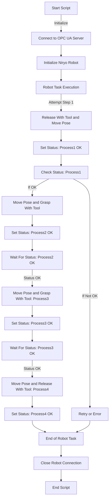

# opcua niryo

# Script Server

Ce script Python utilise la bibliothèque `asyncua` pour créer et configurer un serveur OPC UA (Open Platform Communications Unified Architecture). Voici un commentaire détaillé de chaque section du code :

### Importation des Modules

```python
import asyncio
import logging
from asyncua import Server

```

- `asyncio` : Utilisé pour la programmation asynchrone.
- `logging` : Permet la journalisation pour le débogage et le suivi.
- `asyncua` : Bibliothèque pour créer un serveur ou un client OPC UA.

### Fonction Principale `main`

```python
async def main():

```

- Déclare une fonction asynchrone `main`, qui est le point d'entrée du script.

### Configuration du Logging

```python
    logging.basicConfig(level=logging.DEBUG)
    _logger = logging.getLogger(__name__)

```

- Configure la journalisation pour capturer tous les messages de niveau `DEBUG` et supérieur.
- `_logger` est une instance de `Logger` utilisée pour enregistrer les messages dans ce script.

### Initialisation du Serveur OPC UA

```python
    server = Server()
    await server.init()
    server.set_endpoint("opc.tcp://127.0.0.1:4840/freeopcua/server/")

```

- Crée une instance `Server` de la bibliothèque `asyncua`.
- Initialise le serveur avec `server.init()`.
- Définit l'endpoint du serveur, qui est l'adresse à laquelle les clients peuvent se connecter.

### Enregistrement de l'Espace de Noms

```python
    uri = "opcua_mlf"
    idx = await server.register_namespace(uri)

```

- Crée un espace de noms personnalisé (dans ce cas `"opcua_mlf"`) pour organiser les données.
- `idx` stocke l'index de cet espace de noms dans le serveur.

### Configuration des Variables pour Robots et Processus

```python
    robots_processes = {
        "robot1": ["process1", "process2", "process3", "process4"],
        "robot2": ["process1", "process2", "process3", "process4"],
    }

```

- Définit un dictionnaire `robots_processes` où chaque clé est un nom de robot et chaque valeur est une liste de noms de processus associés à ce robot.

### Création d'Objets et de Variables dans le Serveur

```python
    for robot, processes in robots_processes.items():
        robot_obj = await server.nodes.objects.add_object(idx, robot)
        for process in processes:
            tmpVar = await robot_obj.add_variable(idx, process, "Ready")
            await tmpVar.set_writable()
            _logger.info(f"Variable created for {robot}: {process}")

```

- Pour chaque robot, crée un objet dans le serveur OPC UA.
- Pour chaque processus de chaque robot, crée une variable associée à cet objet.
- Chaque variable est initialisée avec la valeur `"Ready"` et configurée pour être modifiable (`set_writable`).

### Démarrage et Exécution du Serveur

```python
    _logger.info("Server is now starting")
    async with server:
        while True:
            await asyncio.sleep(1)

```

- Enregistre un message indiquant que le serveur démarre.
- Entame une boucle infinie où le serveur reste actif. `await asyncio.sleep(1)` est utilisé pour mettre la boucle en pause pendant 1 seconde à chaque itération, ce qui évite une utilisation excessive du CPU.

### Exécution du Script

```python
if __name__ == "__main__":
    asyncio.run(main())

```

- Vérifie si le script est exécuté comme script principal et non importé comme module.
- Exécute la fonction `main` en utilisant `asyncio.run`, qui est le moyen recommandé de démarrer et de gérer les coroutines `asyncio`.

Ce script établit donc un serveur OPC UA avec une structure de données personnalisée pour gérer des robots et leurs processus. Chaque robot est représenté par un objet dans le serveur, et chaque processus de ce robot est représenté par une variable.

# Script Client

Ce script Python utilise les bibliothèques `asyncua` et `pyniryo` pour effectuer des tâches avec un robot Niryo et communiquer avec un serveur OPC UA. Voici un commentaire détaillé de chaque section du code :

### Importation des Modules

```python
import asyncio
from pyniryo import NiryoRobot
from asyncua import Client

```

- `asyncio` : Pour la programmation asynchrone.
- `pyniryo` : Bibliothèque spécifique pour contrôler les robots Niryo.
- `asyncua` : Bibliothèque pour interagir avec des serveurs OPC UA.

### Configuration Initiale

```python
ROBOT_IP = "192.168.0.103"
OPC_UA_SERVER_URL = "opc.tcp://localhost:4840/freeopcua/server/"
NAMESPACE = "opcua_mlf"

```

- Définit les paramètres de configuration pour le robot Niryo et le serveur OPC UA.

### Fonction `set_status`

```python
async def set_status(client, namespace_index, robot_name, process_name, status):

```

- Fonction asynchrone pour mettre à jour le statut d'un processus d'un robot dans le serveur OPC UA.

### Fonction `get_status`

```python
async def get_status(client, namespace_index, robot_name, process_name):

```

- Fonction asynchrone pour lire le statut d'un processus d'un robot depuis le serveur OPC UA.

### Fonction `waitForStatus`

```python
async def waitForStatus(client, namespace_index, robot_name, process_name, status):

```

- Fonction asynchrone qui attend qu'un statut spécifique soit atteint pour un processus d'un robot.

### Fonction `robot_task`

```python
async def robot_task(robot, client, nsidx, robot_name):

```

- Fonction asynchrone pour exécuter des tâches robotiques et mettre à jour les statuts sur le serveur OPC UA.
- Utilise les fonctions `set_status`, `get_status`, et `waitForStatus` pour gérer la logique des tâches en fonction des statuts des processus.

### Bloc `try-except`

- Chaque bloc `try` dans `robot_task` tente d'effectuer une action spécifique avec le robot et met à jour le statut sur le serveur OPC UA.
- Le bloc `except` capture les éventuelles erreurs, affiche un message d'erreur et met à jour le statut du processus avec "KO".

### Fonction Principale `main`

```python
async def main():

```

- Initialise et calibre le robot Niryo.
- Établit une connexion avec le serveur OPC UA.
- Exécute les tâches robotiques et gère la fermeture de la connexion avec le robot.

### Exécution du Script

```python
if __name__ == "__main__":
    asyncio.run(main())

```

- Vérifie si le script est le module principal et lance la fonction `main`.

Ce script est structuré pour effectuer des tâches séquentielles avec un robot Niryo en fonction de l'état des processus sur un serveur OPC UA. Il intègre une logique de synchronisation basée sur le statut des processus, ce qui permet une interaction coordonnée entre le robot et le serveur.

### Représentation Graphique
