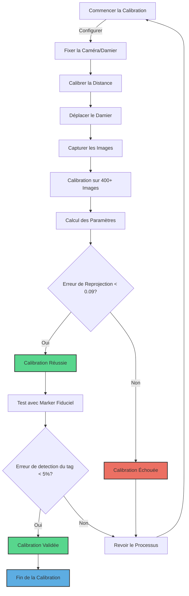
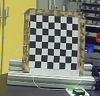
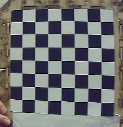
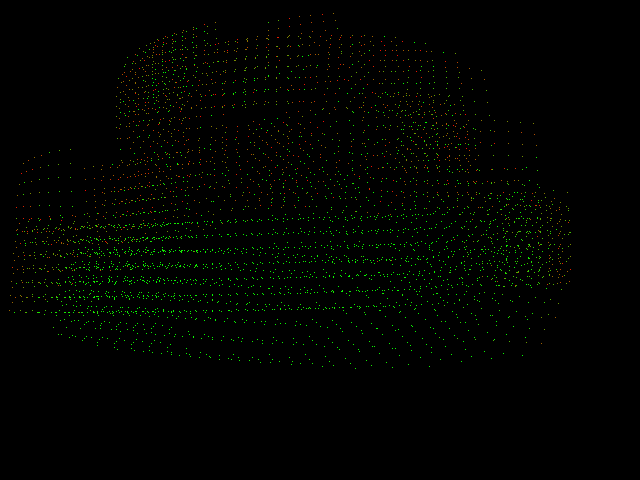
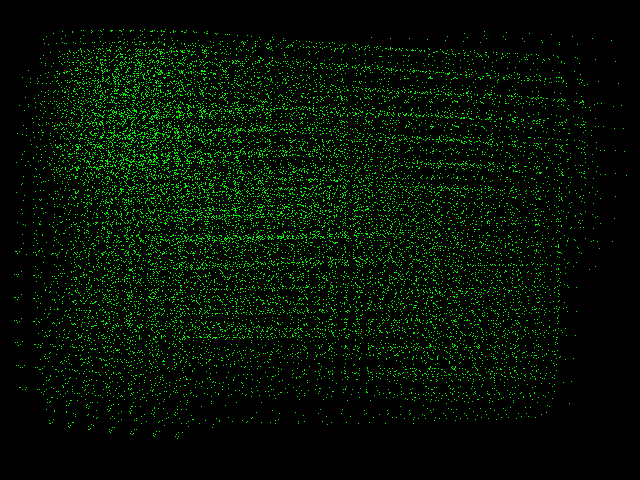

# Méthode de calibration intrinsèque

## Matériel

- Une caméra
- Un damier de taille suffisante et avec un certain nombre de carrés
- Un ordinateur (avec un bon processeur)
- Un marker fiduciel (par exemple ArUco ou AprilTag)
- Un outil de mesure de distance (règle, mètre, télémètre, etc.)

## Représentation visuelle des étapes

## Méthode

- Fixer la caméra. Il est possible de fixer le damier et de faire bouger la caméra, mais cela présente un risque plus important de flou.
- Ils doivent être suffisamment espacés pour vous permettre de bouger le damier dans le champ de la caméra tout en gardant une certaine précision. La distance dépendra énormément de la qualité de votre caméra ainsi que de la taille du damier (compter une vingtaine de pixels par carré).
    - Sur l'exemple ci-dessous (l'image est zoomée), la distance entre la caméra et le damier est d'environ 1m50. On constate que le damier est trop loin de la caméra et que les carrés sont trop petits, rendant impossible une calibration précise.
        
    - Sur cet exemple, l'image est zoomée. La distance entre la caméra et le damier est d'environ 70 cm. On constate que les carrés sont suffisamment grands pour permettre une calibration précise.
        

- Déplacer le damier dans le champ de la caméra de manière à couvrir l'entièreté du damier. Ne pas hésiter à sortir un peu du cadre pour bien couvrir toute la zone.
- Faire la calibration sur au moins 400 images (nul besoin d'atteindre les 1000). Nous parlons ici de 400 images où un damier a été détecté ; il sera donc sûrement nécessaire d'en faire plus. Vous pouvez indiquer, via une variable, une limite d'image pour arrêter automatiquement la détection lorsque le nombre de damiers est atteint.
- Attendre que le calcul des paramètres se fasse. Selon les processeurs, cette étape peut prendre des heures, voire des jours. Un test a été réalisé sur deux processeurs différents, tous deux pour 400 images. Puce M2 de chez Apple ⇒ 485 secondes. Processeur i5-1235U 12e génération de chez Intel ⇒ environ 7h.
- Une fois le calcul terminé, les paramètres seront enregistrés dans le fichier .json que vous avez créé précédemment.

## Validation

- À la fin du calcul des paramètres, il y a aussi un paramètre appelé “erreur_projection”. Plus cette valeur sera faible, plus la calibration sera précise. Une erreur supérieure à 0.09 pixel est trop importante pour considérer la calibration comme précise. Il faut garder à l'esprit qu'il s'agit d'une moyenne et que cela dépend donc beaucoup des étendues. C'est pourquoi une image représentant cette erreur de reprojection a été créée dans le répertoire courant. Chaque point est un pixel représentant un coin du damier.
- Analyser le fichier “reprojection_error_image.png” afin de vérifier que le damier a été détecté sur l'entièreté de la zone.
    - Sur l’exemple ci-dessous, on peut constater des différences.
        
        
        
        
        
    - Sur la première image, on voit que le damier n'a pas été correctement détecté et qu'il y a des zones vides. Plus votre reprojection ressemblera à la deuxième image, plus votre calibration sera précise.
    - Plus le pixel est rouge, plus l'erreur est grande (au maximum 10 pixels). À l'inverse, plus le pixel est vert, plus la reprojection est précise (au minimum 0 pixel).
- Munissez-vous de votre marker fiduciel et placez-le à une distance permettant à la caméra de le voir entièrement. Lancez la détection du marker et relevez la distance indiquée. La précision demandée dépendra de votre besoin, mais considérez que vous avez une bonne calibration si vous avez une erreur de 5 %.

## Conclusion
En conclusion, la calibration intrinsèque d'une caméra est un processus méthodique et précis qui nécessite une attention particulière à chaque étape. Du choix et de la préparation du matériel à l'analyse finale de l'erreur de reprojection, chaque phase contribue de manière significative à la qualité de la calibration. La réussite de cette procédure repose sur la rigueur avec laquelle les images du damier sont capturées et analysées, ainsi que sur l'exactitude des mesures effectuées lors des tests de validation.

L'erreur de reprojection est un indicateur crucial de la précision de la calibration, et maintenir cette erreur en dessous d'un seuil spécifique est essentiel pour garantir la fiabilité des résultats. De plus, les tests pratiques avec un marker fiduciel apportent une validation supplémentaire de la précision de la caméra calibrée, en fournissant une évaluation tangible dans des conditions réelles.

Il est important de se rappeler que la calibration d'une caméra n'est pas seulement un exercice technique, mais aussi une étape fondamentale pour assurer la précision et la fiabilité dans diverses applications, allant de la vision par ordinateur à la robotique. Avec patience, précision et une compréhension approfondie du processus, la calibration intrinsèque de la caméra peut être menée à bien, offrant ainsi une base solide pour tout projet nécessitant une perception visuelle précise.