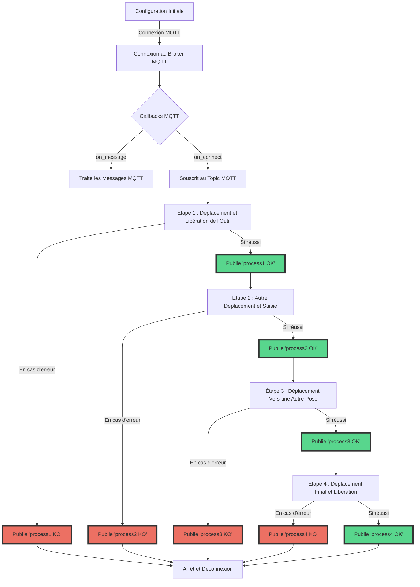

# **Installation des Composants Nécessaires**

## **Installation de Python**

Python est un langage de programmation nécessaire pour exécuter le script. Voici comment l'installer :

1. **Téléchargez Python** : Rendez-vous sur le site officiel de [Python](https://www.python.org/downloads/) et téléchargez la dernière version de Python 3.x pour votre système d'exploitation.
2. **Installez Python** : Lancez l'installateur téléchargé et suivez les instructions. Assurez-vous d'ajouter Python à votre variable d'environnement PATH.

## **Installation de Mosquitto (Broker MQTT)**

Mosquitto est un broker MQTT populaire.  Un broker MQTT est un serveur qui reçoit tous les messages des clients et les redistribue ensuite aux clients appropriés. MQTT, signifiant "Message Queuing Telemetry Transport", est un protocole de messagerie léger, conçu pour les communications dans les réseaux à faible bande passante et peu fiables. Pour l'installer :

1. **Téléchargez Mosquitto** : Visitez le site [Mosquitto](https://mosquitto.org/download/previously)  et téléchargez la version appropriée pour votre système.
2. **Installez Mosquitto** : Suivez les instructions d'installation spécifiques à votre système d'exploitation.
3. **Démarrez Mosquitto** : Démarrez le service Mosquitto. Sous Windows, vous pouvez utiliser le gestionnaire de services (ou la commande `"C:\Program Files\mosquitto\mosquitto.exe" -v -c "mosquitto.conf"`).

## **Installation des Bibliothèques Python Nécessaires**

Les bibliothèques **`paho-mqtt`** et **`pyniryo`** sont nécessaires pour ce script. 

1. **`paho-mqtt`** : Cette bibliothèque est un client MQTT pour Python. Elle est utilisée pour connecter le script Python au broker MQTT, souscrire à des topics, publier des messages et traiter les messages entrants. 
2. **`pyniryo`** : Cette bibliothèque est spécifiquement conçue pour interagir avec les robots Niryo. Elle fournit une interface de programmation (API) pour contrôler le robot, permettant au script d'envoyer des commandes pour manipuler le robot, comme déplacer ses bras, ouvrir ou fermer sa pince, etc. L'utilisation de pyniryo simplifie grandement le processus de programmation en fournissant des fonctions haut niveau pour interagir avec le robot.

Installez-les en utilisant pip, le gestionnaire de paquets de Python :

```bash
bashCopy code
pip install paho-mqtt
pip install pyniryo  # Cette bibliothèque peut nécessiter des étapes d'instal
```

# Guide d'utilisation du script de contrôle de robot Niryo via MQTT

Ce document sert de guide pour utiliser et modifier le script Python permettant de contrôler un robot Niryo en utilisant MQTT pour la communication.

## Prérequis

- Python 3.x installé
- Bibliothèques `paho-mqtt` (>=1.6.1) et `pyniryo` installées (>=1.1.2)
- Un robot Niryo avec une adresse IP fixe
- Un broker MQTT opérationnel

## Configuration initiale

Le script démarre par la configuration initiale du robot et du client MQTT :

```python
robot = NiryoRobot("192.168.0.103")  # Remplacer par l'adresse IP de votre robot
robot.calibrate_auto()
robot.update_tool()

client = mqtt.Client()

```

## Connexion MQTT

La connexion au broker MQTT se fait avec l'adresse IP du broker et le port :

```python
client.connect("127.0.0.1", 1883, 60)  # Remplacer par l'adresse IP de votre broker MQTT
client.loop_start()

```

## Callbacks MQTT

Deux fonctions de rappel sont utilisées pour gérer les messages MQTT :

- `on_message` : Traite les messages entrants et met à jour le dictionnaire `feedbacks`.
- `on_connect` : S'exécute lors de la connexion au broker MQTT et souscrit au topic nécessaire.

## Fonctions Utilitaires

- `getStatus(etapeName)`: Retourne le statut d'une étape spécifique.
- `waitForStatus(etapeName, status)`: Attend jusqu'à ce que le statut souhaité pour une étape spécifique soit atteint.

## Définition des Étapes

Chaque étape de contrôle du robot est définie dans une section de code `try`...`except`. Par exemple :

```python
# etape 1
try:
    robot.release_with_tool()
    robot.move_pose(0.2, -0.2, 0.2, 0, 1.57, 0)
    client.publish("robot1", "process1 OK")
except Exception as e:
    print(f"Error: {e}")
    client.publish("robot1", "process1 KO")

```

## Ajout de Nouvelles Étapes

Pour ajouter de nouvelles étapes :

1. Copiez le bloc de code `try`...`except` d'une étape existante.
2. Modifiez les actions du robot (`robot.move_pose`, `robot.grasp_with_tool`, etc.) selon les besoins de la nouvelle étape.
3. Publiez le statut approprié via MQTT (`client.publish`).

## Arrêt et Déconnexion

À la fin du script, le client MQTT est arrêté et déconnecté :

```python
client.loop_stop()
client.disconnect()

```

## Modification et Extension

Le script peut être modifié pour inclure plus d'étapes ou pour changer les mouvements du robot. Assurez-vous de tester chaque nouvelle étape individuellement pour éviter des comportements inattendus.

## Représentation Visuelle

---

Ce guide fournit une vue d'ensemble de la structure et de l'utilisation du script. Pour toute modification, assurez-vous de comprendre le fonctionnement de base des robots Niryo et de MQTT.