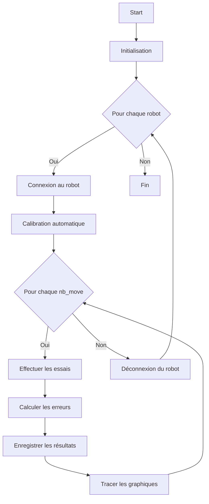

# Niryo Robot Repeatability Test

Ce projet contient un script Python pour tester la répétabilité des mouvements d'un robot Niryo. Le script effectue plusieurs essais pour mesurer les erreurs de positionnement et d'angle après des mouvements répétés.

## Installation

### Prérequis

Assurez-vous d'avoir Python 3.x installé sur votre machine. Installez les dépendances nécessaires en utilisant le fichier `requirements.txt` fourni.

```sh
pip install -r requirements.txt
```

### Dépendances

- `pyniryo`
- `numpy`
- `matplotlib`

## Utilisation

### Configuration

1. Modifiez la liste `robots_ips` avec les adresses IP de vos robots Niryo.
2. Ajustez `nb_moves_list` pour spécifier le nombre de mouvements à tester.
3. Spécifiez le nombre d'essais avec `nb_trial`.
4. Le fichier de résultats sera sauvegardé sous le nom `results.txt`.

### Exécution

Exécutez le script avec Python :

```sh
python your_script.py
```

### Fonctionnalités

- **GoBack** : Teste la répétabilité des mouvements aller-retour.
- **measure_repeatability_by_joint** : Mesure la répétabilité des mouvements pour chaque joint.
- **plot_joint_errors_by_trial** : Génère des graphiques des erreurs pour chaque joint.
- **plot_overall_errors** : Génère des graphiques des erreurs globales.
- **plot_angular_error_per_joint** : Génère des graphiques des erreurs angulaires pour chaque joint.

### Exemple de sortie

Le script génère un fichier de log `results.txt` et des graphiques illustrant les erreurs de répétabilité des mouvements du robot.

## Diagramme Mermaid



### Description du Diagramme

- **Start** : Début du script.
- **Initialisation** : Chargement des configurations et des paramètres.
- **Pour chaque robot** : Boucle sur chaque robot listé dans `robots_ips`.
  - **Connexion au robot** : Connexion au robot Niryo.
  - **Calibration automatique** : Calibration du robot.
  - **Pour chaque nb_move** : Boucle sur chaque valeur de `nb_moves_list`.
    - **Effectuer les essais** : Effectuer les essais de mouvement.
    - **Calculer les erreurs** : Calculer les erreurs de positionnement et d'angle.
    - **Enregistrer les résultats** : Enregistrer les résultats dans un fichier.
    - **Tracer les graphiques** : Générer les graphiques des erreurs.
  - **Déconnexion du robot** : Déconnexion du robot.
- **Fin** : Fin du script.

## Auteurs

- Damian Lari

## Conclusion

Ce fichier `README.md` fournit une description détaillée de l'installation, de l'utilisation et du fonctionnement du script, ainsi qu'un diagramme Mermaid pour visualiser le flux du script. Assurez-vous d'adapter les noms de fichiers et de variables selon vos besoins spécifiques.