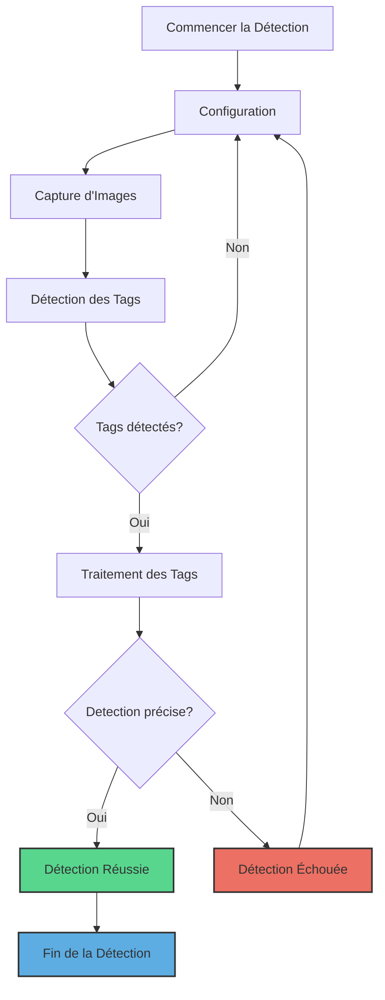

```mermaid
graph TD
    A[Commencer la Détection] --> B[Configuration]
    B --> C[Capture d'Images]
    C --> D[Détection des Tags]
    D --> E{Tags détectés?}
    E -- Oui --> F[Traitement des Tags]
    E -- Non --> B
    F --> G{Detection précise?}
    G -- Oui --> H[Détection Réussie]
    G -- Non --> I[Détection Échouée]
    I --> B
    H --> J[Fin de la Détection]

    style H fill:#58D68D,stroke:#333,stroke-width:2px
    style I fill:#EC7063,stroke:#333,stroke-width:2px
    style J fill:#5DADE2,stroke:#333,stroke-width:2px

```